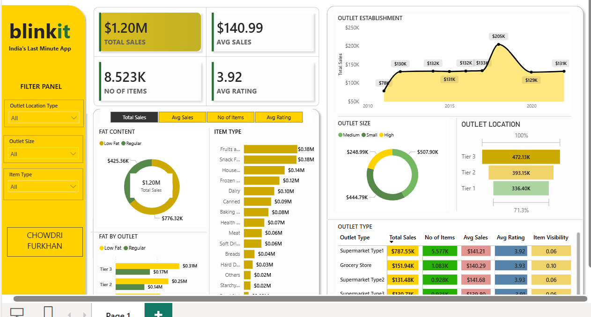

# 🛒 Blinkit Sales Analysis Dashboard

## 📌 Project Overview
This project presents an interactive **Power BI Dashboard** built to analyze **Blinkit's sales performance, customer satisfaction, and inventory distribution**. The dashboard provides actionable insights through key performance indicators (KPIs), advanced visualizations, and dynamic filtering capabilities.

The primary objective is to help stakeholders understand sales trends, outlet performance, customer preferences, and inventory distribution patterns to support data-driven business decisions.

---

## 🎯 Business Requirement

To conduct a comprehensive analysis of Blinkit's:

- Sales Performance
- Customer Satisfaction
- Inventory Distribution

and identify key insights and opportunities for optimization using various KPIs and visualizations in Power BI.

---

# 📊 Key Performance Indicators (KPIs)

The dashboard tracks the following KPIs:

### 1️⃣ Total Sales
Overall revenue generated from all items sold.

### 2️⃣ Average Sales
Average revenue generated per sale transaction.

### 3️⃣ Number of Items
Total count of items sold across all outlets.

### 4️⃣ Average Rating
Average customer rating of products sold.

---

# 📈 Dashboard Features & Analysis

## 1. Total Sales by Fat Content

### Objective
Analyze the impact of product fat content on total sales.

### Insights
- Compare sales between:
  - Low Fat Products
  - Regular Fat Products
- Evaluate:
  - Total Sales
  - Average Sales
  - Number of Items
  - Average Rating

### Visualization Used
- Donut Chart

---

## 2. Total Sales by Item Type

### Objective
Identify the performance of various item categories based on total sales.

### Insights
Analyze sales performance for:

- Fruits & Vegetables
- Snack Foods
- Household Products
- Frozen Foods
- Dairy Products
- Beverages
- Bakery Items
- Meat Products
- Health & Hygiene Products
- Others

### Visualization Used
- Horizontal Bar Chart

---

## 3. Fat Content by Outlet for Total Sales

### Objective
Compare sales generated from Low Fat and Regular products across different outlet tiers.

### Insights
Evaluate:

- Total Sales
- Average Sales
- Number of Items
- Average Rating

across:

- Tier 1
- Tier 2
- Tier 3

### Visualization Used
- Clustered Bar Chart

---

## 4. Total Sales by Outlet Establishment

### Objective
Evaluate how outlet establishment year influences total sales performance.

### Insights
Analyze sales trends based on outlet age and growth over time.

### Visualization Used
- Area Chart / Line Chart

---

## 5. Percentage of Sales by Outlet Size

### Objective
Analyze the relationship between outlet size and sales contribution.

### Outlet Categories
- Small
- Medium
- High

### Visualization Used
- Donut Chart

---

## 6. Sales by Outlet Location

### Objective
Assess sales distribution across outlet locations.

### Outlet Tiers
- Tier 1
- Tier 2
- Tier 3

### Visualization Used
- Funnel Chart

---

## 7. All Metrics by Outlet Type

### Objective
Provide a complete comparison of all KPIs across outlet types.

### Metrics Included
- Total Sales
- Number of Items
- Average Sales
- Average Rating
- Item Visibility

### Outlet Types
- Grocery Store
- Supermarket Type 1
- Supermarket Type 2
- Supermarket Type 3

### Visualization Used
- Matrix Table

---

# 🛠️ Tools & Technologies Used

| Tool | Purpose |
|--------|---------|
| Power BI | Dashboard Development |
| Power Query | Data Cleaning & Transformation |
| DAX | KPI Calculations & Measures |
| Excel | Data Source |

---

# 📂 Project Structure

```text
Blinkit-Sales-Analysis/
│
├── Blinkit PowerBI Dashboard.pbix
├── README.md
└── Dashboard_Preview.png
```

---

# 📷 Dashboard Preview



---

# 📌 Dashboard Filters

The dashboard includes interactive slicers for:

- Outlet Location Type
- Outlet Size
- Item Type

These filters enable users to perform detailed analysis and drill down into specific business segments.

---

# 📊 Key Insights

### Sales Performance
- Total Sales: **$33.42K**
- Average Sales: **$141**
- Number of Items Sold: **8523**
- Average Rating: **3.9**

### Outlet Analysis
- Tier 3 outlets generated the highest sales.
- Medium-sized outlets contributed the largest sales share.
- Supermarket Type 1 showed the highest revenue contribution.

### Product Analysis
- Low Fat products generated significant revenue.
- Fruits & Vegetables and Snack Foods were among the top-performing categories.

---

# 🚀 How to Use

1. Download the repository.
2. Open the `.pbix` file using Power BI Desktop.
3. Refresh the dataset if required.
4. Use dashboard filters to explore insights interactively.

---

# 🎯 Business Value

This dashboard helps stakeholders:

- Monitor overall sales performance.
- Understand customer preferences.
- Optimize inventory distribution.
- Identify high-performing outlets.
- Improve business decision-making through data-driven insights.

---

# 👨‍💻 Author

**Ayaan Pasha**

Aspiring Data Analyst | AI/ML Engineer | Power BI Developer

📍 Bangalore, India

---

## ⭐ If you found this project useful, consider giving it a star!
